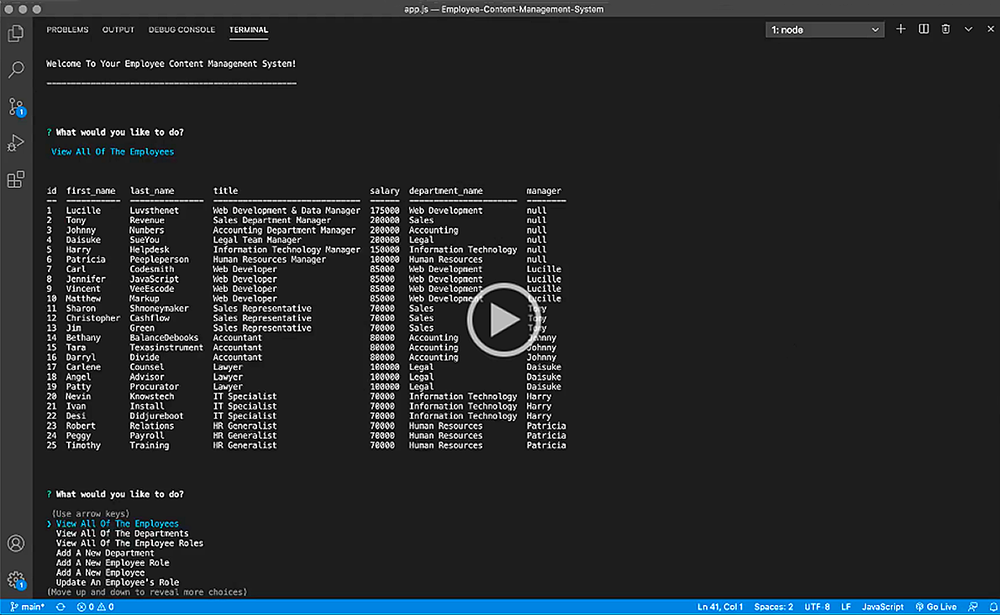

# Employee Content Management System‏‏‎
‎‎ 
  

  ---
  
  
&nbsp;

    

## Description 

&nbsp;

<strong><em>What is this project? Why did you make this project? How did you make this project?</strong></em>

&nbsp;

Developers are often tasked with creating interfaces that make it easy for non-developers to view and interact with information stored in databases. Often these interfaces are known as Content Management Systems. This command line application is useful for managing company's employees of all sizes using  using `Node,js`, `inquirer npm`, and `MySQL`. A user can view their entire employee roster, view all departments, view all roles, add roles, add departments, add employees, and update existing employee roles.

&nbsp;

View the application usage demo here =>‏‏‎ ‎‏‏‎ ‎‏‏‎ ‎‏‏[`DEMO`](https://drive.google.com/drive/folders/1kfNFaUwkdvxojVr8zGOiAcjgzGF-zaW8)

&nbsp;

---

&nbsp;

## Table of Contents: 

&nbsp;

* [Installation](#installation)
* [Usage](#usage)
* [Schema](#schema)
* [License](#license)
* [Credits](#credits)
* [Questions](#questions)

&nbsp;

---

&nbsp;

## Installation

&nbsp;

<strong><em>What are the steps required to install this project?</strong></em>

&nbsp;

To make use of this application, you must first download the repo, and then run `npm install` within the terminal to begin the install of `inquirer``MySQL`, & `console.table` dependencies. These required dependencies are already provided within the included `package.json` file. 

&nbsp;

&nbsp;

---

&nbsp;

## Usage

&nbsp;

<strong><em>Instructions and examples for usage:</strong></em>

&nbsp;

You can begin using this command line content management system by running `node app.js` within the terminal. A welcome screen along with menu items for actions is presented. The given code is already attached to an SQL file database with multiple tables that will allow a user to interact with, update, and add employees it.

&nbsp;

View a video overview on usage here:

 

&nbsp;

---

&nbsp;

&nbsp;

---

&nbsp;

## Schema

&nbsp;

&nbsp;

**MySQL Database Layout**:

&nbsp;

* **Department**:

  * **id** - INT PRIMARY KEY
  * **name** - VARCHAR(30) to hold department name

* **Role**:

  * **id** - INT PRIMARY KEY
  * **title** -  VARCHAR(30) to hold role title
  * **salary** -  DECIMAL to hold role salary
  * **department_id** -  INT to hold reference to department role belongs to

* **Employee**:

  * **id** - INT PRIMARY KEY
  * **first_name** - VARCHAR(30) to hold employee first name
  * **last_name** - VARCHAR(30) to hold employee last name
  * **role_id** - INT to hold reference to role employee has
  * **manager_id** - INT to hold reference to another employee that manager of the current employee. 

&nbsp;

---

&nbsp;

## License

&nbsp;

This project is covered under the MIT license. 

&nbsp;

---

&nbsp;

## Credits

&nbsp;

<strong><em>Third party assets:</strong></em>

&nbsp;

`Node.js` =>‏‏‎ ‎ ‏‏‎ ‎[An asynchronous event-driven runtime built on Chrome's V8 JavaScript engine.](https://nodejs.org/en/)

&nbsp;‏‏‎‏‏‎ ‎<strong>+</strong>

`MySQL` =>‏‏‎ ‎ ‏‏‎ ‎[The world's most popular open source database ](hhttps://www.mysql.com/)

&nbsp;‏‏‎‏‏‎ ‎<strong>+</strong>

`MySQL npm` =>‏‏‎ ‎ ‏‏‎ ‎[A pure Node.js JavaScript Client implementing the MySQL protocol.](https://www.npmjs.com/package/mysql)

&nbsp;‏‏‎‏‏‎ ‎<strong>+</strong>

`console.table` =>‏‏‎ ‎ ‏‏‎ ‎[Adds console.table method within node for convenience.](https://www.npmjs.com/package/console.table)

&nbsp;‏‏‎‏‏‎ ‎<strong>+</strong>

`dotenv npm` =>‏‏‎ ‎ ‏‏‎ ‎[Shhhhhh!](https://www.npmjs.com/package/dotenv)

&nbsp;

---

&nbsp;

## Questions?

&nbsp;

Shoot me an e-mail! => jonathan@jonathanschimpf.com

&nbsp;

Check out more of my work here on =>
[GitHub](http://github.com/jonathanschimpf)

&nbsp;

